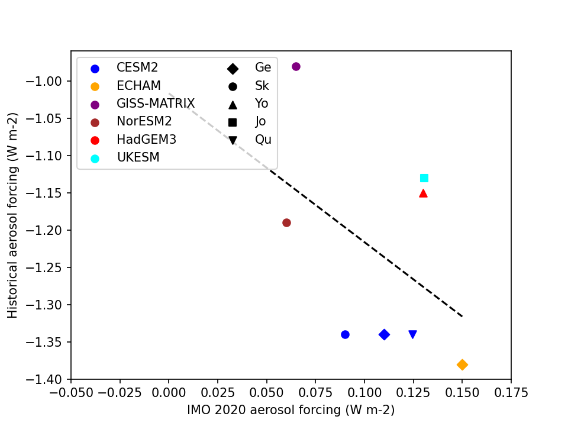

IMO 2020 Experiment (imo2020)
=========================

## Title: Can IMO 2020 Serve as an Emergent Constraint for Historical Aerosol Forcing?


## Organizers:
- Michael Diamond ([msdiamond@fsu.edu](mailto:msdiamond@fsu.edu))

## Deadlines for Submission of Model Data:
- **Tier I Experiments:** TBD
- **Tier II Experiments:** TBD, but presumably later
  
---

## Motivation:

Can we use the aerosol radiative forcing from the IMO 2020 shipping regulations, which is in theory observable, as an emergent constraint for historical aerosol effective radiative forcing overall?

Starting in January 2020, the global limit on the sulfur mass content of marine fuels decreased from 3.5% to 0.5%; the actual decrease, however, was probably closer to an 80% reduction because the average marine fuel sold at market pre-2020 had a sulfur content of 2.5% (Diamond, 2023). A decline in detectible ship tracks was observed almost immediately (Watson-Parris et al., 2022; Yuan et al., 2022) and, unlike those observed during regional implementations of stricter emissions regulations (Gryspeerdt et al., 2019), were global in nature with no systematic compensation outside the major pre-existing shipping routes. A reduction in shipping-induced cloud microphysical perturbations have also been observed in individual tracks (Manshausen et al., 2023) and within a shipping corridor (Diamond, 2023). A hybrid model-observations analysis has estimated the global forcing from the IMO 2020 regulations as 0.14 W m-2 (Yuan et al., 2024) while global climate model forcings range from ~0.05 to 0.15 W m-2 (Gettelman et al. , 2024; Jordan & Henry, 2024; Quaglia & Visioni, 2024; Skeie et al., 2024; Yoshioka et al., 2024). Both internal variability and structural differences amongst the models appear to affect the results, as well as differences in boundary conditions (e.g., 80 versus 85% reductions in fuel sulfur and choices around nudging to meteorology). 

Figure 1 below illustrates the range of current model estimates, along with their historical aerosol effective radiative forcing estimates from Smith et al. (2021). There is at least a hint of a relationship between the forcing produced for IMO 2020 conditions and the total historical aerosol forcing. In this experiment, we propose testing whether the IMO 2020 perturbation can help constrain historical aerosol forcing (as quantified by the aci-baseline experiment) when simulated under a common protocol.


---

## Objectives:
- Test how well modeled IMO 2020 cloud changes/forcings correlate with historical aerosol forcing from all sources
- Test how well global IMO 2020 cloud changes/forcing correlates with regional forcing (specifically, SE Atlantic)
- Calculate observational constraints on historical aerosol forcing from observed global and/or regional cloud changes/forcings after IMO 2020 went into effect
- [If needed] Constrain global IMO 2020 forcing from regional cloud changes/forcings
---

## Proposed Model Experiments:

Tier 1: Control (2019 meteorology and 2015 CEDS emissions) and IMO2020 (80% reduction in shipping $\mathrm{SO}_2$)

Tier 2: IMO2020-SEA (80% reduction in shipping $\mathrm{SO}_2$ in SE Atlantic shipping corridor only)

### General Simulation Requirements:
- **Simulation Period:** Year 2017
- **Nudging:** Yes, to ERA5 meteorology (temperature and winds) for year 2017
- **SST:** NOAAGlobalTemp
- **Repetitions:** At least 5 years of repeated nudged meteorology/SST/emission conditions to constain snyoptic variability but maintain uncertainty due to different cloud evolutions 

---
## Tier 1 Simulations:
Description of the Tier 1 simulations (does not need to be a table).

| Simulation Name | Emissions | Purpose                                 |
|-----------------|-----------|-----------------------------------------|
| CTRL            | 2015 CEDS | Control simulation                      |
| 20shp           | 20% of 2015 CEDS shipping  $\mathrm{SO}_2$ | Forcing from 80% reduction in shipping $\mathrm{SO}_2$ |

### Tier 2 Simulations:


| Simulation Name | Emissions | Purpose                                 |
|-----------------|-----------|-----------------------------------------|
| 20shp-SEA       | 20% of 2015 CEDS shipping  $\mathrm{SO}_2$ in SE Atlantic only | Test whether regional SE Atlantic cloud changes can be generalized globally|

---
## Diagnostics ##

 *   Data in NetCDF format, one variable and year per file with CMOR variable names
 *   All data are 3-dimensional, e.g., ``( lon x lat x time )``; if your model
     uses other than a lon-lat coordinate system, please provide the data in
     your model's native format (no post-processing remapping)
 *   Filename format is ``aerocom_<ModelName>_<ExperimentName>_<VariableName>_<VerticalCoordinateType>_<Period>_<Frequency>.nc``,\
    where ``<ModelName>`` can be chosen such that model name, model version and possibly the institution can be identified. No underscores (``_``) are allowed in ``<ModelName>``. Use (-) instead. Max 20 characters. \
    ``<ExperimentName>`` = ``CTRL``, ``20shp``, ``20shp-SEA``\
    ``<VariableName>`` see list below \
    ``<VerticalCoordinateType>`` => "Surface", "TOA", "Column", "ModelLevel" \
    ``<Period>`` => "2017" \
    ``<Frequency>`` => "timeinvariant","hourly", ,"3hourly", "daily", "monthly" 
 *  CFMIP COSP diagnostics provided by COSP do not need to be run through cmor because the names are the same, 
      but please separate files for each variable

<!-- In addition to the diagnostics below, it is highly recommended to store the AEROCOM standard and forcing diagnostics, so that the simulations can be analysed for the direct forcing as well, and future more in-depth analyses are possible.  -->

## Model Output Submission:
Submit your model output via the AeroCom website: [Submit Data](https://aerocom.met.no/FAQ/data_access/submit_data).

### Model Output Naming Convention:
The format for the AeroCom file name (one variable per file) should be:

`aerocom4_<ModelName>_<YOUR_EXPERIMENT_NAME>-<SimulationName>_<VariableName>_<VerticalCoordinateType>_<Year>_monthly.nc`

#### Example Filenames:
- `aerocom4_GEOS-i33p2_imo2020-CTRL_od550aer_Column_2017_monthly.nc`


## Model Output Variables:

### 2D diagnostics (3-hourly instantaneous) ### 

For evaluation with satellite data and for ERFaci decomposition (Gryspeerdt et al. 2020)

| name | long_name (CF if possible) | units | description |
| ---- |  ---- |  ---- |  ---- |
| od550aer  | atmosphere_optical_thickness_due_to_aerosol | 1 | Aerosol optical depth (@ 550 nm) |
| aod550aer  | atmosphere_absorbinh optical_thickness_due_to_aerosol | 1 | Aerosol optical depth (@ 550 nm) |
| angstrm | AOD_Angstrom_exponent | 1 | |
| aerindex |aerosol_index  | 1  | od550aer*angstrm |
| cdr | liquid_cloud-top_droplet_effective_radius | m  | Grid cell mean droplet effective radius at top of liquid water clouds |
| cdnc | liquid_cloud_droplet_number_concentration | m-3 | Grid cell mean droplet number concentration in top layer of liquid water clouds |
| cdnum  | column_cloud_droplet_number_concentration    | m-2  | grid cell mean column total |
| icnum  | column_ice_crystal_number_concentration    | m-2  | grid cell mean column total |
| clt | cloud_area_fraction | 1 | Fractional cover by all clouds |
| lcc | liquid_cloud_area_fraction  | 1 | Fractional cover by liquid water clouds |
| lwp | atmosphere_cloud_liquid_path | kg m-2 | grid cell mean liquid water path for liquid water clouds |
| iwp | atmosphere_cloud_ice_path | kg m-2 | grid cell mean ice water path for ice clouds |
| icr | cloud-top_ice_crystal_effective_radius | m | grid cell mean effective radius of crystals at top of ice clouds |
| icc | ice_cloud_area_fraction | 1  | Fractional cover by ice clouds |
| cod | cloud_optical_depth | 1 	| Grid cell mean cloud optical depth |
| codliq | cloud_optical_depth_due_to_liquid | 1 	| Grid cell mean cloud optical depth |
| codice | cloud_optical_depth_due_to_ice | 1 	| Grid cell mean cloud optical depth |
| ccn0.1bl | cloud_condensation_nuclei_0.1_pbl | m-3 | CCN number concentration at S=0.1% at 1 km above the surface |
| ccn0.3bl | cloud_condensation_nuclei_0.3_pbl | m-3 | CCN number concentration at S=0.3% at 1 km above the surface |
| colccn.1 | column_cloud_condensation_nuclei_0.1 | m-2 | column-integrated CCN number concentration at S=0.1%  |
| colccn.3 | column_cloud_condensation_nuclei_0.3 | m-2 | column-integrated CCN number concentration at S=0.3%  |
| rsut | toa_upward_shortwave_flux | W m-2 	| TOA upward SW flux, all-sky |
| rsutcs | toa_upward_shortwave_flux_assuming_clear_sky | W m-2 | TOA upward SW flux, clear-sky |
| rsutnoa | toa_upward_shortwave_flux_no_aerosol | W m-2 | TOA upward SW flux, all-sky, aerosol removed from calculation |
| rsutcsnoa | toa_upward_shortwave_flux_clear_sky_no_aerosol |W m-2 | TOA upward SW flux, clear-sky, aerosol removed from calculation |
| rlut | toa_upward_longwave_flux | W m-2 | TOA upward LW flux, all-sky |
| rlutcs | toa_upward_longwave_flux_assuming_clear_sky | W m-2 | TOA upward LW flux, clear-sky |
| hfls 	| surface_upward_latent_heat_flux | W m-2 | Surface latent heat flux |
| hfss | surface_upward_sensible_heat_flux  | W m-2 | Surface sensible heat flux |
| rls | surface_net_downward_longwave_flux_in_air | W m-2 | Net surface LW downward flux |
| rss | surface_net_downward_shortwave_flux | W m-2 | Net surface SW downward flux |
| rsds | surface_downwelling_shortwave_flux_in_air | W m-2 | Surface SW downward flux (to estimate the model's 'true' surface albedo) |
| ttop | air_temperature_at_cloud_top | K | Temperature at top of clouds, weighted by cloud cover |
| lts | lower_tropospheric_stability | K | Difference in potential temperature between 700 hPa and 1000 hPa |
| u10  | zonal wind at 10 m height | m s-1 | provide lowest model level wind if 10 m is not diagnosed|
| v10  | meridional wind at 10 m height | m s-1 | provide lowest model level wind if 10 m is not diagnosed|
| u700  | zonal wind at 700 hPa | m s-1 | |
| v700  | meridional wind at 700 hPa | m s-1 | |
| u200  | zonal wind at 200 hPa | m s-1 | |
| v200  | meridional wind at 200 hPa | m s-1 | |
| w500  | vertical_velocity_dp/dt_at_500_hPa | hPa s-1 | |
| w700  | vertical_velocity_dp/dt_at_700_hPa | hPa s-1 | |
| lts   | potential temperature difference (theta at 700_hPa -- theta at 1000 hPa) | K | |
| sprecip | stratiform_precipitation_rate	| kg m-2 s-1	| grid cell mean at surface |
| autoconv | column_autoconversion_rate | kg m-2 s-1	| grid cell mean column total |
| accretn | column_accretion_rate	| kg m-2 s-1	| grid cell mean column total |
| wbf | Wegener--Bergeron--Findeisen rate	| kg m-2 s-1	| grid cell mean column total |

### Monthly-mean fields ###

As above, plus a land-ocean mask (0 land, 1 ocean).

### CFMIP COSP 2D diagnostics (3-hourly instantaneous) ### 

Optional, but highly desirable for models with COSP

| name | long_name (CF if possible) |	units |	description | comment | notes |
| ---- | ---- | ---- | ---- | ---- | ---- |
| clwmodis | modis_liquid_cloud_fraction | 1 | Column fractional cover by liquid water clouds  | from modis simulator |
| reffclwmodis | modis_droplet_effective_radius*clwmodis  | m | grid cell mean  | from modis simulator |
| climodis  | modis_ice_cloud_fraction	|1 | Column fractional cover by ice water clouds  |from modis simulator	|  |
| reffclimodis | modis_ice_effective_radius*climodis	| m | grid cell mean  | from modis simulator |
| tauwmodis | modis_liquid_cloud_optical_thickness*clwmodis | 1 | grid cell mean | from modis simulator |
| tauimodis | modis_ice_cloud_optical_thickness*climodis | 1 | grid cell mean | from modis simulator |
| parasolRefl | toa_bidirectional_reflectance | 1 | PARASOL Reflectance | Simulated reflectance from PARASOL as seen at the top of the atmosphere for 5 solar zenith angles. Valid only over ocean and for one viewing direction (viewing zenith angle of 30 degrees and relative azimuth angle 320 degrees). | |
| cltcalipso | cloud_area_fraction | % | CALIPSO Total Cloud Fraction  | | |
| cllcalipso | cloud_area_fraction_in_atmosphere_layer | % | CALIPSO Low Level Cloud Fraction  | | |
| clmcalipso | cloud_area_fraction_in_atmosphere_layer | % | CALIPSO Middle Level Cloud Fraction  | | |
| clhcalipso | cloud_area_fraction_in_atmosphere_layer | % | CALIPSO High Level Cloud Fraction  | | |

### CFMIP COSP 2D diagnostics (monthly-mean fields) ### 

Optional, but highly desirable for models with COSP

| name | long_name (CF if possible) |	units |	description | comment | notes |
| ---- | ---- | ---- | ---- | ---- | ---- |
| jpdftaureliqmodis | MODIS Optical Thickness-Particle Size joint distribution, liquid | % | MODIS Optical Thickness-Particle Size Joint Distribution, Liquid [%]  | from modis simulator |

*TBD: include Brandon Duran's/Casey Wall's monthly-mean COSP histogram ERFaci decomposition?*

## Sampling of cloud-top quantities ## 

The idea is to use the cloud overlap assumption (maximum, random, or
maximum-random) to estimate which part of the cloud in a layer can be seen from
above.

Note: For the CCN, whether to sample it in the same way as CDNC, or use a similar approach (going from bottom up)    
to sample it at cloud base depends on your parameterization of the activation.

let $i=1,2,...,nx$ be the index for the horizontal grid-points \
let $k=1,2,...,nz$ be the index for the vertial levels, with 1 being the uppermost level, and nz the surface level 

### "Cloud-top" calculation ### 
This piece of Fortran code was used to calculate the Phase 2 Indirect3 ACI diagnostics.
We suggest using it again for the Phase 4 ACI baseline experiment.  Models that
participated in Phase 2 Indirect3 probably already have an implementation of
this that can be reused. 

``` fortran
thres_cld = 0.001  
thres_cod = 0.3  
IF ( iovl = random OR iovl = maximum-random ) THEN
  clt(i) = 1.
ELSE
  clt(:) = 0
ENDIF  
icc(:) = 0  
lcc(:) = 0  
ttop(:) = 0  
cdr(:) = 0  
icr(:) = 0  
cdnc(:) = 0


DO i=1,nx
	DO k=2,nz ! assumption: uppermost layer is cloud-free (k=1)
		IF ( cod3d(i,k) > thres_cod and f3d(i,k) > thres_cld ) THEN ! visible, not-too-small cloud
			! flag_max is needed since the vertical integration for maximum overlap is different from the two others: for maximum, clt is the actual cloud cover in the level, for the two others, the actual cloud cover is 1 - clt
			! ftmp is total cloud cover seen from above down to the current level
			! clt is ftmp from the level just above
			! ftmp - clt is thus the additional cloud fraction seen from above in this level

			IF ( iovl = maximum ) THEN
				flag_max = -1.
				ftmp(i) = MAX( clt(i), f3d(i,k))  ! maximum overlap	
			ELSEIF ( iovl = random ) THEN
				flag_max = 1.
				ftmp(i) = clt(i) * ( 1 - f3d(i,k) ) ! random overlap	
			ELSEIF ( iovl = maximum-random ) THEN
				flag_max = 1.
				ftmp(i) = clt(i) * ( 1 - MAX( f3d(i,k), f3d(i,k-1) ) ) / &
   	            ( 1 - MIN( f3d(i,k-1), 1 - thres_cld ) )  ! maximum-random overlap	
			ENDIF
			ttop(i) = ttop(i) + t3d(i,k) * ( clt(i) - ftmp(i) )*flag_max 

			! ice clouds
			icr(i) = icr(i) + icr3d(i,k) * ( 1 - phase3d(i,k) ) * ( clt(i) - ftmp(i) )*flag_max 
			icc(i) = icc(i) + ( 1 - phase3d(i,k) ) * ( clt(i) - ftmp(i) )*flag_max 
	
			! liquid water clouds
			cdr(i) = cdr(i) + cdr3d(i,j) * phase3d(i,k) * ( clt(i) - ftmp(i) )*flag_max 
			cdnc(i) = cdnc(i) + cdnc3d(i,j) * phase3d(i,k) * ( clt(i) - ftmp(i) )*flag_max 
			lcc(i) = lcc(i) + phase3d(i,k) * ( clt(i) - ftmp(i) )*flag_max 
			
			clt(i) = ftmp(i)
		ENDIF ! is there a visible, not-too-small cloud?
	ENDDO ! loop over k

	IF ( iovl = random OR iovl = maximum-random ) THEN
		clt(i) = 1. - clt(i)
	ENDIF
ENDDO ! loop over I
```

<!-- naming convention for the input variables: -->

<!--     utctime current time of the day in UTC in seconds   -->
<!--     time_step_len length of model time-step   -->
<!--     lon(nx) longitude in degrees from 0 to 360    -->

 <!-- ==== Q/A ==== -->

 <!-- *    2D cloud fields (lwp, iwp, cdr, cdnc, ttop, cod): Please save them as grid-box mean values but DO NOT divide by the total (2D) cloud cover, which will be done in analysis after averaging in time and space.  -->
         
 <!-- *    The three months 1 October - 31 December 2005  are thought as spin-up, which can of course be longer. Please choose as overlap assumption the one you use in the radiation scheme.   -->
    
 <!-- *    ATTENTION: clt(i) has to be initialized to 1 for random or maximum-random overlap assumptions in the "satellite simulator"   -->

 <!-- *   CCN definition: Compute CCN using Kohler theory at 0.1 and 0.3 % supersaturation. -->


---

## References:

Diamond, M. S.: Detection of large-scale cloud microphysical changes within a major shipping corridor after implementation of the International Maritime Organization 2020 fuel sulfur regulations, Atmos. Chem. Phys., 23, 8259-8269, 10.5194/acp-23-8259-2023, 2023.

Gettelman, A., Christensen, M. W., Diamond, M. S., Gryspeerdt, E., Manshausen, P., Stier, P., Watson‐Parris, D., Yang, M., Yoshioka, M., and Yuan, T.: Has Reducing Ship Emissions Brought Forward Global Warming?, Geophysical Research Letters, 51, 10.1029/2024gl109077, 2024.

Gryspeerdt, E., Smith, T. W. P., O'Keeffe, E., Christensen, M. W., and Goldsworth, F. W.: The Impact of Ship Emission Controls Recorded by Cloud Properties, Geophysical Research Letters, 46, 12547– 12555, 10.1029/2019gl084700, 2019.

Gryspeerdt, E., Mülmenstädt, J., Gettelman, A., Malavelle, F. F., Morrison, H., Neubauer, D., Partridge, D. G., Stier, P., Takemura, T., Wang, H., Wang, M., and Zhang, K.: Surprising similarities in model and observational aerosol radiative forcing estimates, Atmospheric Chemistry and Physics, 20, 613-623, 10.5194/acp-20-613-2020, 2020.

Jordan, G., and Henry, M.: IMO2020 Regulations Accelerate Global Warming by up to 3 Years in UKESM1, Earth's Future, 12, 10.1029/2024ef005011, 2024.

Manshausen, P., Watson-Parris, D., Christensen, M. W., Jalkanen, J. P., and Stier, P.: Rapid saturation of cloud water adjustments to shipping emissions, Atmos. Chem. Phys., 23, 12545-12555, 10.5194/acp-23-12545-2023, 2023.

Quaglia, I., and Visioni, D.: Modeling 2020 regulatory changes in international shipping emissions helps explain anomalous 2023 warming, Earth Syst. Dynam., 15, 1527-1541, 10.5194/esd-15-1527-2024, 2024.

Skeie, R. B., Byrom, R., Hodnebrog, Ø., Jouan, C., and Myhre, G.: Multi-model effective radiative forcing of the 2020 sulfur cap for shipping, Atmos. Chem. Phys., 24, 13361-13370, 10.5194/acp-24-13361-2024, 2024.

Smith, C. J., Harris, G. R., Palmer, M. D., Bellouin, N., Collins, W., Myhre, G., Schulz, M., Golaz, J. C., Ringer, M., Storelvmo, T., and Forster, P. M.: Energy Budget Constraints on the Time History of Aerosol Forcing and Climate Sensitivity, Journal of Geophysical Research: Atmospheres, 126, 10.1029/2020jd033622, 2021.

Watson-Parris, D., Christensen, M. W., Laurenson, A., Clewley, D., Gryspeerdt, E., and Stier, P.: Shipping regulations lead to large reduction in cloud perturbations, Proc Natl Acad Sci U S A, 119, e2206885119, 10.1073/pnas.2206885119, 2022.

Yoshioka, M., Grosvenor, D. P., Booth, B. B. B., Morice, C. P., and Carslaw, K. S.: Warming effects of reduced sulfur emissions from shipping, Atmos. Chem. Phys., 24, 13681-13692, 10.5194/acp-24-13681-2024, 2024.

Yuan, T., Song, H., Wood, R., Wang, C., Oreopoulos, L., Platnick, S. E., von Hippel, S., Meyer, K., Light, S., and Wilcox, E.: Global reduction in ship-tracks from sulfur regulations for shipping fuel, Science Advances, 8, eabn7988, doi:10.1126/sciadv.abn7988, 2022.

Yuan, T., Song, H., Oreopoulos, L., Wood, R., Bian, H., Breen, K., Chin, M., Yu, H., Barahona, D., Meyer, K., and Platnick, S.: Abrupt reduction in shipping emission as an inadvertent geoengineering termination shock produces substantial radiative warming, Commun Earth Environ, 5, 281, 10.1038/s43247-024-01442-3, 2024.
